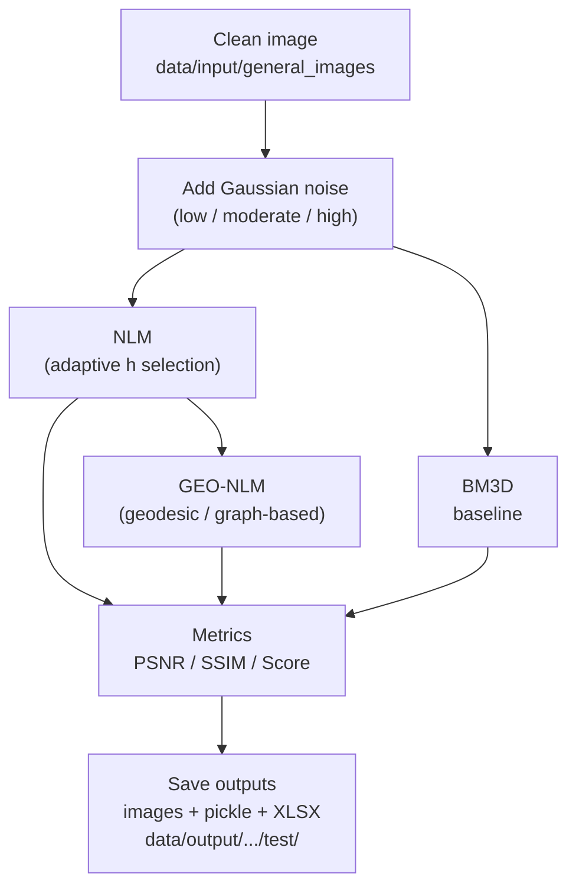

# GaussianExperiments

Reproducible Gaussian denoising experiments with **RAPIDS + CuPy** (GPU), **NumPy**, and **BM3D** (CPU).  
The environment is fully **reproducible**, frozen via:

- `conda-spec-linux-64.txt` → **explicit Conda lockfile**  
- `requirements-pip.txt` → pip-only dependencies (e.g., `bm3d`)

No package solving occurs during container build.

---

## Requirements

- **Docker**
- **NVIDIA GPU** + CUDA **12.2**-compatible drivers (optional but recommended)
- **VS Code** + **Dev Containers** extension

> **Windows Tip:**  
> Use **WSL2 (Ubuntu)** and open the repository from the **WSL filesystem**  
> (avoid paths like `\\wsl.localhost\...` — they cause permission and performance issues).

## Recommended Setup on Windows (WSL2 + Docker Desktop)
---

To avoid errors and ensure GPU detection:

### Install and configure WSL2
Install **Ubuntu** from Microsoft Store.  
Set WSL2 as default:

powershell
wsl --set-default-version 2

### Configure Docker Desktop

Open Docker Desktop → go to:

⚙️ Settings → General

✔️ Enable "Use the WSL 2 based engine"

⚙️ Settings → Resources → WSL Integration

✔️ Enable your Linux distro (e.g., Ubuntu 22.04)

✔️ Keep checked: “Enable integration with additional distros”

Click Apply & Restart.

### Quick Start (VS Code + Dev Containers)
---

1 - Open this folder in VS Code (inside WSL2).

2 - Press **Ctrl+Shift+P →**
**Dev Containers: Rebuild and Reopen in Container**

3 - This will:

- Build the full Docker environment
- Restore Conda env via conda-spec-linux-64.txt
- Install pip packages from requirements-pip.txt

## Sanity check:

python - << 'PY'
import cupy as cp, numpy as np, skimage, bm3d
print("GPUs detected:", cp.cuda.runtime.getDeviceCount())
PY

## Quick Start (Docker CLI)

# Build image
docker build -t gaussian-frozen .

# Open container
docker run --gpus=all --shm-size=4g -it --rm \
    -v "$PWD":/workspace -w /workspace gaussian-frozen bash

## Repository Layout
GaussianExperiments/ 
├─ .devcontainer/                 # VS Code container settings  
│   └─ Dockerfile   
│   └─ conda-spec-linux-64.txt    # Frozen Conda environment  
│   └─ requirements-pip.txt       # Extra pip-only dependencies  
│
├─ data/  
│  ├─ input/  
│  │  └─ general_images/               # Clean input images (PNG/JPG)  
│  └─ output/  
│     ├─ pg_noisy/
│     │  └─ {bm3d,nlm,geonlm}/  
│     ├─ set12/  
│     │  └─ high_noisy/> {bm3d,geonlm,nlm,results,test}/  
      │  └─ test/> {bm3d,nlm,geonlm}/  

│     └─ set50/  
│        └─ test/> {bm3d,nlm,geonlm}/  
├─ src/
│  ├─ main_low.py                      # LOW noise experiments  
│  ├─ main_moderate.py                 # MODERATE noise experiments  
│  ├─ main_high.py                     # HIGH noise experiments  
│  ├─ Gaussian_low.py  
│  ├─ Gaussian_moderate.py  
│  ├─ Gaussian_high.py  
│  ├─ noisy_functions.py  
│  ├─ nlm_functions.py  
│  ├─ geonlm_functions.py  
│  ├─ Utils.py  
│  └─ gaussian_experiments/            # Jupyter notebooks  
├─ Makefile  
└─ README.md  

## Running Experiments

From **inside the container:**

**LOW noise**
python -m src.main_low

**MODERATE noise**
python -m src.main_moderate

**HIGH noise**
python -m src.main_high

Outputs will appear in:

data/output/{low_noisy,moderate_noisy,high_noisy}/test/{NLM,BM3D,GEONLM}/

Each script saves:

Denoised images (.png)

Pickle tables (.pkl)

Consolidated metrics spreadsheet (.xlsx)

Selected hyperparameters (h, mult, etc.)

## Experiment Pipeline (Flowchart)

## Reproducibility & Environment

This project is fully reproducible because:

✔ A frozen explicit spec is used
conda list --explicit --md5 > conda-spec-linux-64.txt

✔ Pip requirements are isolated

requirements-pip.txt contains only packages not available via Conda.

✔ Container images contain everything needed

The Dockerfile sets:

pinned versions

CUDA 12.2 base

fixed dependencies

Updating the environment

If you modify packages inside the container:

conda list --explicit --md5 > conda-spec-linux-64.txt

Avoid adding Conda-managed packages to requirements-pip.txt.

## Makefile (Helper)

The repository includes a Makefile for convenience.

Available commands:
make dirs      # create output dirs
make low       # run LOW-noise experiments
make moderate  # run MODERATE-noise experiments
make high      # run HIGH-noise experiments
make all       # run all experiments (low + moderate + high)
make clean     # wipe output data

## Data & Outputs

Large experiment outputs can bloat the repo.
Use Git LFS if needed:

git lfs install
echo "data/** filter=lfs diff=lfs merge=lfs -text" >> .gitattributes

## Troubleshooting
❌ GPU not found inside container

Check host GPU:

nvidia-smi

Check Docker Desktop → WSL Integration → enable your distro

Check inside container:

python - << 'PY'
import cupy as cp
print(cp.cuda.runtime.getDeviceCount())
PY

❌ Permission denied when writing outputs

Ensure project is located inside:

/home/<user>/...

NOT inside:

/mnt/c/Users/...

❌ Container slow because it is solving Conda dependencies

This repo avoids solving by using an explicit spec.
If you need flexibility:

Modify environment inside the container

Re-export lockfile

## Reproducing Results (For Reviewers)

This section recreates all tables/figures from the manuscript.

**A. Build environment**

Use VS Code Dev Containers (recommended):

Dev Containers: Rebuild and Reopen in Container

**B. Place images**

Put clean images into:

data/input/general_images/

**C. Run experiments**
make low
make moderate
make high

Or all:

make all

**D. Find results**

Each experiment outputs:

data/output/<noise>_noisy/test/{NLM,GEONLM,BM3D}/
data/output/<noise>_noisy/test/results/*.xlsx

**Tables used in the paper:**

Noise Level	Results (XLSX)
Low noise	gnlm_bm3d_low_filtereds.xlsx
Moderate noise	gnlm_bm3d_moderate_filtereds.xlsx
High noise	gnlm_bm3d_high_filtereds.xlsx

## License
License: [MIT](./LICENSE)  
SPDX-Identifier: `MIT`
